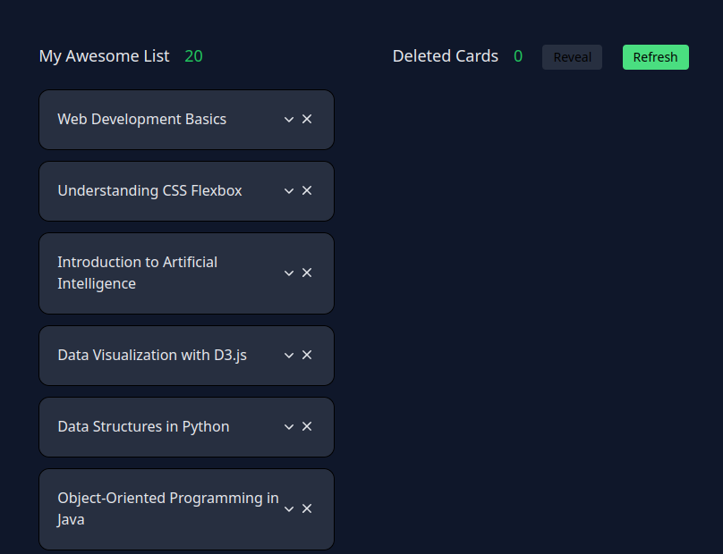

## Task Solution

This is my rendition of the Task, rules are described at the end.

## Rules

- add/remove/modify existing code to achieve the end result (some code needs a refactor)
- don't install additional packages
- you need to use `zustand`, but it's up to you to decide what state should be global
- write the code like it's a real feature

### Cards

- add expand/collapse functionality
- make sure the "Delete" button works
- add animations

### Deleted Cards

- display the number of deleted cards
- reveal deleted cards after user clicks the "Reveal" button - deleted card variant shouldn't contain the description
- write the code, so in the future you will be able to add "revert" functionality

### Behavior

- cards by default should be collapsed
- expanded/deleted cards' state needs to be persisted after "refreshing" (regardless of isVisible property)
- "refresh" functionality needs to be implemented using `react-query`

### Miscellaneous

- add a "Refresh" button (just like the "Reveal" button)
- create generic `<ToggleButton />`

### Additional

You may leave a message explaining your coding choices, but it's not necessary.
Testing framework isn't installed, so instead just explain whether you think it's a good or bad idea to write tests for this feature or how to approach it.
